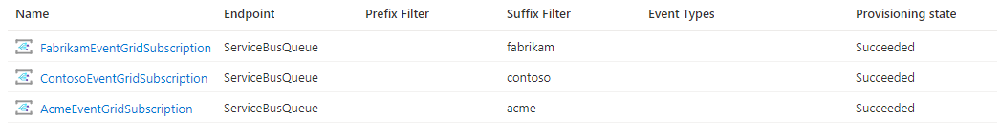

# Azure Event Grid Custom Topic as a Message Broker

Asynchronous messaging and event-driven communication are critical assets when building a distributed application that's composed of several internal and external services. This sample shows how to use an [Azure Event Grid Custom Topic](https://learn.microsoft.com/en-us/azure/event-grid/custom-topics) as a message broker in a multitenant scenario to send messages to multiple [Azure Service Bus](https://learn.microsoft.com/en-us/azure/service-bus-messaging/service-bus-messaging-overview) queues in different namespaces, one for each tenant.

[Azure Event Grid](https://learn.microsoft.com/en-us/azure/event-grid/overview) is a highly scalable, serverless event broker that you can use to integrate applications using events. Events are delivered by Event Grid to subscriber destinations such as applications, Azure services, or any endpoint to which Event Grid has network access. The source of those events can be other applications, SaaS services and Azure services.

With [Azure Event Grid](https://learn.microsoft.com/en-us/azure/event-grid/overview) you can connect solutions using an [event-driven architecture](https://learn.microsoft.com/en-us/azure/architecture/guide/architecture-styles/event-driven). An event-driven architecture uses the [Publisher-Subscriber design pattern](https://learn.microsoft.com/en-us/azure/architecture/patterns/publisher-subscriber) to dispatch events to one or more consumer applications and services to notify state changes. You can use [filters](https://learn.microsoft.com/en-us/azure/event-grid/event-filtering) to route specific events to different endpoints, multicast to multiple endpoints, and make sure your events are reliably delivered.

For guidelines how to build a messaging or eventing infrastructure in a multitenant solution, see [Architectural approaches for messaging in multitenant solutions](https://learn.microsoft.com/en-us/azure/architecture/guide/multitenant/approaches/messaging).

## Scenario

A multitenant application, that serves requests for multiple tenants, needs to route incoming messages to multiple [Azure Service Bus](https://learn.microsoft.com/en-us/azure/service-bus-messaging/service-bus-messaging-overview) namespaces, one for each tenant. Every message is intended for a single tenant, and the solution needs to implement a message broker that routes incoming messages based on user-defined properties or payload. The multitenant application uses a specific Service Bus namespace for each tenant. This deployment approach provides your solution with the maximum level of isolation, with the ability to provide consistent performance per tenant. You can also fine-tune messaging capabilities for each tenant based on their needs, such as by using the following approaches:

- Deploy the namespace to a region that's close to the tenant.
- Deploy a tenant-specific namespace with a pricing tier that's appropriate to that tenant. For example, you can provision premium namespaces with a different number of messaging units.
- Apply networking restrictions based on the tenant's needs.
- Use tenant-specific encryption keys.

The disadvantage to this isolation model is that, as the number of tenants grows within your system over time, the operational complexity of managing your namespaces also increases. If you reach the maximum number of namespaces per Azure subscription, you could deploy namespaces across different subscriptions (see deployment stamp pattern). This approach also increases resource costs, since you pay for each namespace you provision. For more information on tenancy models for the [Azure Service Bus](https://learn.microsoft.com/en-us/azure/service-bus-messaging/service-bus-messaging-overview), see [Multitenancy and Azure Service Bus](https://learn.microsoft.com/en-us/azure/architecture/guide/multitenant/service/service-bus).

## Architecture

The following picture shows the architecture of the sample:


The architecture is composed of the following Azure resources:

- [Microsoft.EventGrid/topics](https://learn.microsoft.com/en-us/azure/templates/microsoft.eventgrid/topics?pivots=deployment-language-bicep): an [Azure Event Grid Custom Topic](https://learn.microsoft.com/en-us/azure/event-grid/custom-topics) used as a message broker that receives messages from one or more publisher applications and dispatches messages in JSON format to tenant-specific queues based on [the starting or ending value of the event subject](https://learn.microsoft.com/en-us/azure/event-grid/event-filtering) or based on [filter expression defined on the properties of the payload](https://learn.microsoft.com/en-us/azure/event-grid/event-filtering#advanced-filtering).
- [Microsoft.EventGrid/topics/eventSubscriptions](https://learn.microsoft.com/en-us/azure/templates/microsoft.eventgrid/topics/eventsubscriptions?pivots=deployment-language-bicep): an [Azure Event Grid Subscription](https://learn.microsoft.com/en-us/azure/event-grid/custom-topics) is used to send events to the `events` queue of a tenant-specific [Azure Service Bus](https://learn.microsoft.com/en-us/azure/service-bus-messaging/service-bus-messaging-overview) namespace. The sample uses a simple filter based on the ending value of the subject which contains the tenant's name in lowercase.
- [Microsoft.ServiceBus/namespaces](https://learn.microsoft.com/en-us/azure/templates/microsoft.servicebus/namespaces?pivots=deployment-language-bicep): an [Azure Service Bus](https://learn.microsoft.com/en-us/azure/service-bus-messaging/service-bus-messaging-overview) namespace and a queue for each tenant. The sample deploys three tenants (`Fabrikam`, `Contoso`, and `Acme`), but you can modify the list of tenants.
- [Microsoft.Storage/storageAccounts](https://docs.microsoft.com/en-us/azure/templates/microsoft.storage/storageaccounts): when the [Azure Event Grid Custom Topic](https://learn.microsoft.com/en-us/azure/event-grid/custom-topics) receives an error for an event delivery attempt, the AZure Event Grid service decides whether it should [retry the delivery, dead-letter the event, or drop the event based on the type of the error](https://learn.microsoft.com/en-us/azure/event-grid/delivery-and-retry). When creating an event subscription, you can customize the settings for event delivery and dead-letter. This storage account is used to store dead-letter events for all the [Azure Event Grid Subscriptions](https://learn.microsoft.com/en-us/azure/event-grid/custom-topics). For more information, see [Set dead-letter location and retry policy](https://learn.microsoft.com/en-us/azure/event-grid/manage-event-delivery).

For more information, see the following articles:

- [Custom topics in Azure Event Grid](https://learn.microsoft.com/en-us/azure/event-grid/custom-topics)
- [Azure Event Grid event schema](https://learn.microsoft.com/en-us/azure/event-grid/event-schema)
- [Quickstart: create and route custom events with the Azure portal](https://learn.microsoft.com/en-us/azure/event-grid/custom-event-quickstart-portal)
- [Quickstart: route custom events to Azure Queue storage](https://learn.microsoft.com/en-us/azure/event-grid/custom-event-to-queue-storage)
- [How to: post to custom topic](https://learn.microsoft.com/en-us/azure/event-grid/post-to-custom-topic)
- [Quickstart: create and route custom events with Azure CLI](https://learn.microsoft.com/en-us/azure/event-grid/custom-event-quickstart)
- [Azure CLI: create Event Grid custom topic](https://learn.microsoft.com/en-us/azure/event-grid/scripts/event-grid-cli-create-custom-topic)
- [Azure CLI: subscribe to events for a custom topic](https://learn.microsoft.com/en-us/azure/event-grid/scripts/event-grid-cli-subscribe-custom-topic)
- [Quickstart: create and route custom events with Azure PowerShell](https://learn.microsoft.com/en-us/azure/event-grid/custom-event-quickstart-powershell)
- [PowerShell: create Event Grid custom topic](https://learn.microsoft.com/en-us/azure/event-grid/scripts/event-grid-powershell-create-custom-topic)
- [PowerShell: subscribe to events for a custom topic](https://learn.microsoft.com/en-us/azure/event-grid/scripts/event-grid-powershell-subscribe-custom-topic)
- [Resource Manager template: custom topic and WebHook endpoint](https://github.com/Azure/azure-quickstart-templates/tree/master/quickstarts/microsoft.eventgrid/event-grid)
- [Resource Manager template: custom topic and Event Hubs endpoint](https://github.com/Azure/azure-quickstart-templates/tree/master/quickstarts/microsoft.eventgrid/event-grid-event-hubs-handler)

## Requirements

Install the latest version of the [Azure CLI](https://learn.microsoft.com/en-us/cli/azure/install-azure-cli).

## Deploy the Solution

Change the working directory to the `scripts` folder which contains the bash scripts. Before deploying the sample, make sure to properly set values for the variables imported and used by all the scripts in the `00-variables.sh` file in the `scripts` folder.

```sh
# Variables for the Event Grid demo

# Location
location="WestEurope"

# Resource group name
resourceGroupName="SampleEventGridRG"

# Event Grid Topic
topicName="SampleEventGrid"
publicNetworkAccess="enabled"
tags="service=EventGrid workload=$topicName"

# Subscription endpoint type
endpointType="servicebusqueue"

# Sku of the service bus namespace
serviceBusSku="Standard"

# Name of the service bus queue
serviceBusQueueName="events"

# Name of the deadletter storage account
storageAccountName="deadletterstore"

# Name of the deadletter container
containerName="deadletter"

# Tenants
tenants=("Fabrikam" "Contoso" "Acme")

# Events
id=1000
eventType="recordInserted"

# SubscriptionId of the current subscription
subscriptionId=$(az account show --query id --output tsv)
subscriptionName=$(az account show --query name --output tsv)
```

Run the `01-create-event-grid.sh` script under the `scripts` folder to create the [Azure Event Grid Custom Topic](https://learn.microsoft.com/en-us/azure/event-grid/custom-topics) used as a message broker.

```sh
#!/bin/bash

# Variables
source ./00-variables.sh

# Check if the resource group already exists
echo "Checking if [$resourceGroupName] resource group actually exists in the [$subscriptionName] subscription..."

az group show --name $resourceGroupName &>/dev/null

if [[ $? != 0 ]]; then
  echo "No [$resourceGroupName] resource group actually exists in the [$subscriptionName] subscription"
  echo "Creating [$resourceGroupName] resource group in the [$subscriptionName] subscription..."

  # Create the resource group
  az group create --name $resourceGroupName --location $location 1>/dev/null

  if [[ $? == 0 ]]; then
    echo "[$resourceGroupName] resource group successfully created in the [$subscriptionName] subscription"
  else
    echo "Failed to create [$resourceGroupName] resource group in the [$subscriptionName] subscription"
    exit
  fi
else
  echo "[$resourceGroupName] resource group already exists in the [$subscriptionName] subscription"
fi

# Check if the event grid topic exists
echo "Checking if [$topicName] event grid topic actually exists in the [$subscriptionName] subscription..."
eventGridTopicId=$(az eventgrid topic show \
  --name $topicName \
  --resource-group $resourceGroupName \
  --query id \
  --output tsv 2>/dev/null)

# Create event grid topic if it does not exist
if [[ -z $eventGridTopicId ]]; then
  echo "No [$topicName] event grid topic exists in [$subscriptionName] subscription"
  # Create event grid topic
  echo "Creating [$topicName] event grid exists in [$resourceGroupName] resource group..."
  az eventgrid topic create \
    --location $location \
    --name $topicName \
    --resource-group $resourceGroupName \
    --mi-system-assigned \
    --public-network-access $publicNetworkAccess \
    --tags $tags 1>/dev/null

  if [[ $? == 0 ]]; then
    echo "[$topicName] event grid successfully created in the [$resourceGroupName] resource group"
  else
    echo "Failed to create [$topicName] event grid in the [$resourceGroupName] resource group"
    exit
  fi
else
  echo "[$topicName] event grid topic already exists in [$resourceGroupName] resource group"
fi
```

Then, run the `02-create-service-bus-subscribers.sh` script under the `scripts` folder to create the following resources:

- An [Azure Service Bus](https://learn.microsoft.com/en-us/azure/service-bus-messaging/service-bus-messaging-overview) namespace and `events` queue for each tenant.
- An [Azure Storage Account](https://learn.microsoft.com/en-us/azure/storage/blobs/storage-blobs-overview) for dead-letter events.
- An [Azure Event Grid Subscription](https://learn.microsoft.com/en-us/azure/event-grid/custom-topics) for each tenant to send events to the `events`queue of the corresponding [Azure Service Bus](https://learn.microsoft.com/en-us/azure/service-bus-messaging/service-bus-messaging-overview) namespace.

```sh
#!/bin/bash

# Variables
source ./00-variables.sh

# Check if the event grid topic exists
echo "Checking if [$topicName] event grid topic actually exists in the [$subscriptionName] subscription..."
resourceId=$(az eventgrid topic show \
  --name $topicName \
  --resource-group $resourceGroupName \
  --query id \
  --output tsv 2>/dev/null)

# Create event grid topic if it does not exist
if [[ -n $resourceId ]]; then
  echo "[$topicName] event grid topic exists in [$resourceGroupName] resource group"
else
  echo "No [$topicName] event grid topic exists in [$subscriptionName] subscription"
  exit
fi

# Check if the resource group already exists
echo "Checking if [$resourceGroupName] resource group actually exists in the [$subscriptionName] subscription..."

az group show --name $resourceGroupName &>/dev/null

if [[ $? != 0 ]]; then
  echo "No [$resourceGroupName] resource group actually exists in the [$subscriptionName] subscription"
  echo "Creating [$resourceGroupName] resource group in the [$subscriptionName] subscription..."
  az group create \
    --name $resourceGroupName \
    --location $location 1>/dev/null

  # Create the resource group
  if [[ $? == 0 ]]; then
    echo "[$resourceGroupName] resource group successfully created in the [$subscriptionName] subscription"
  else
    echo "Failed to create [$resourceGroupName] resource group in the [$subscriptionName] subscription"
    exit
  fi
else
  echo "[$resourceGroupName] resource group already exists in the [$subscriptionName] subscription"
fi

# Check if the storage account for deadletter messages exists
echo "Checking if [$storageAccountName] storage account exists for the [$topicName] event grid topic..."
storageAccountId=$(az storage account show \
  --name $storageAccountName \
  --resource-group $resourceGroupName \
  --query id \
  --output tsv 2>/dev/null)

if [[ -z $storageAccountId ]]; then
  # Create Storage Account
  echo "No [$storageAccountName] storage account exists in the [$resourceGroupName] resource group"
  echo "Creating [$storageAccountName] storage account in the [$resourceGroupName] resource group..."

  az storage account create \
    --name $storageAccountName \
    --resource-group $resourceGroupName \
    --query id \
    --output tsv 1>/dev/null

  if [[ $? == 0 ]]; then
    echo "[$storageAccountName] storage account successfully created in the [$resourceGroupName] resource group"
  else
    echo "Failed to create [$storageAccountName] storage account in the [$resourceGroupName] resource group"
    exit
  fi
else
  echo "[$storageAccountName] storage account already exists in the [$resourceGroupName] resource group"
fi

# Get the storage account key
echo "Retrieving the primary key of the [$storageAccountName] storage account..."
storageAccountKey=$(az storage account keys list \
  --account-name $storageAccountName \
  --resource-group $resourceGroupName \
  --query [0].value -o tsv)

if [[ -n $storageAccountKey ]]; then
  echo "Primary key of the [$storageAccountName] storage account successfully retrieved"
else
  echo "Failed to retrieve the primary key of the [$storageAccountName] storage account"
  exit
fi

# Create the deadletter container
echo "Checking if the [$containerName] container already exists in the [$storageAccountName] storage account..."
name=$(az storage container show \
  --name $containerName \
  --account-name $storageAccountName \
  --account-key $storageAccountKey \
  --query name \
  --output tsv 2>/dev/null)

if [[ -z $name ]]; then
  # Create Storage Account
  echo "No [$containerName] container exists in the [$storageAccountName] storage account"
  echo "Creating [$containerName] container in the [$storageAccountName] storage account..."
  az storage container create \
    --name $containerName \
    --account-name $storageAccountName \
    --account-key $storageAccountKey \
    --query id \
    --output tsv 1>/dev/null

  if [[ $? == 0 ]]; then
    echo "[$containerName] container successfully created in the [$storageAccountName] storage account"
  else
    echo "Failed to create [$containerName] container in the [$storageAccountName] storage account"
    exit
  fi
else
  echo "[$containerName] container already exists in the [$storageAccountName] storage account"
fi

for tenant in ${tenants[@]}; do

  # Variables
  serviceBusNamespace="${tenant}ServiceBusNamespace"
  eventGridSubscriptionName="${tenant}EventGridSubscription"
  subjectEndsWith="${tenant,,}"

  # Check if the service bus namespace already exists
  echo "Checking if [$serviceBusNamespace] service bus namespace actually exists in the [$subscriptionName] subscription..."

  az servicebus namespace show \
    --name $serviceBusNamespace \
    --resource-group $resourceGroupName &>/dev/null

  if [[ $? != 0 ]]; then
    echo "No [$serviceBusNamespace] service bus namespace actually exists in the [$subscriptionName] subscription"
    echo "Creating [$serviceBusNamespace] service bus namespace in the [$subscriptionName] subscription..."
    az servicebus namespace create \
      --name $serviceBusNamespace \
      --location $location \
      --resource-group $resourceGroupName \
      --mi-system-assigned \
      --sku $serviceBusSku 1>/dev/null

    # Create the service bus namespace
    if [[ $? == 0 ]]; then
      echo "[$serviceBusNamespace] service bus namespace successfully created in the [$subscriptionName] subscription"
    else
      echo "Failed to create [$serviceBusNamespace] service bus namespace in the [$subscriptionName] subscription"
      exit
    fi
  else
    echo "[$serviceBusNamespace] service bus namespace already exists in the [$subscriptionName] subscription"
  fi

  # Check if the service bus queue already exists
  echo "Checking if [$serviceBusQueueName] service bus queue actually exists in the [$serviceBusNamespace] service bus namespace..."

  az servicebus queue show \
    --name $serviceBusQueueName \
    --namespace-name $serviceBusNamespace \
    --resource-group $resourceGroupName &>/dev/null

  if [[ $? != 0 ]]; then
    echo "No [$serviceBusQueueName] service bus queue actually exists in the [$serviceBusNamespace] service bus namespace"
    echo "Creating [$serviceBusQueueName] service bus queue in the [$serviceBusNamespace] service bus namespace..."

    az servicebus queue create \
      --name $serviceBusQueueName \
      --namespace-name $serviceBusNamespace \
      --resource-group $resourceGroupName 1>/dev/null

    # Create the service bus namespace
    if [[ $? == 0 ]]; then
      echo "[$serviceBusQueueName] service bus queue successfully created in the [$serviceBusNamespace] service bus namespace"
    else
      echo "Failed to create [$serviceBusQueueName] service bus queue in the [$serviceBusNamespace] service bus namespace"
      exit
    fi
  else
    echo "[$serviceBusQueueName] service bus queue already exists in the [$serviceBusNamespace] service bus namespace"
  fi

  # Get service bus resource id
  serviceBusId=$(az servicebus queue show \
    --name $serviceBusQueueName \
    --namespace-name $serviceBusNamespace \
    --resource-group $resourceGroupName \
    --query id \
    --output tsv)

  if [[ -n $serviceBusId ]]; then
    echo "Resource id for the [$serviceBusQueueName] service bus queue successfully retrieved"
  else
    echo "Failed to retrieve the resource id of the [$serviceBusQueueName] service bus queue."
    exit
  fi

  # Check if the Event Grid subscription exists
  az eventgrid event-subscription show \
    --name $eventGridSubscriptionName \
    --source-resource-id $resourceId &>/dev/null

  if [[ $? != 0 ]]; then
    echo "No [$eventGridSubscriptionName] Event Grid subscription actually exists for [$subscriptionName] subscription events"
    echo "Creating [$eventGridSubscriptionName] Event Grid subscription for [$subscriptionName] subscription events..."
    # Create Event Grid subscription
    az eventgrid event-subscription create \
      --endpoint-type $endpointType \
      --endpoint $serviceBusId \
      --deadletter-endpoint ${storageAccountId}/blobServices/default/containers/$containerName \
      --name $eventGridSubscriptionName \
      --subject-ends-with $subjectEndsWith \
      --source-resource-id $resourceId 1>/dev/null

    # Create the Event Grid subscription
    if [[ $? == 0 ]]; then
      echo "[$eventGridSubscriptionName] Event Grid subscription successfully created in the [$subscriptionName] subscription"
    else
      echo "Failed to create [$eventGridSubscriptionName] Event Grid subscription in the [$subscriptionName] subscription"
      exit
    fi
  else
    echo "[$eventGridSubscriptionName] Event Grid subscription already exists in the [$subscriptionName] subscription"
  fi
done
```

## Verify the Deployment

If you successfully deployed the sample, you should see the following Azure resource in the target resource group:


If you open the Azure Event Grid Topic and select the Event Subscriptions, you should see the following subscriptions, one for each tenant, and each with a `ServiceBusQueue` endpoint.



## Test the solution

You can use the `03-send-events.sh` script under the `scripts` folder to send a batch of events to the Azure Event Grid Custom Topic, one for each tenant, using a [curl](https://curl.se/) command. For more information, see [Publish events to Azure Event Grid custom topics using access keys](https://learn.microsoft.com/en-us/azure/event-grid/post-to-custom-topic).
The scripts performs the following operations:

- Creates a JSON array containing an event for each tenant.
- Retrieves the URL of the Azure Event Grid Custom Topic endpoint.
- Retrieves the key of the Azure Event Grid Custom Topic.
- Sends the event array to the Azure Event Grid Custom Topic endpoint using a `curl` command. The call uses the key retrieved at the previous step in the `aeg-sas-key` header to authenticate with the Azure Event Grid. For more information, see [Authenticate Azure Event Grid publishing clients using access keys or shared access signatures](https://learn.microsoft.com/en-us/azure/event-grid/authenticate-with-access-keys-shared-access-signatures).

```sh
#!/bin/bash

# Variables
source ./00-variables.sh

json="["
for ((i=0;i<${#tenants[@]};i++)); do
    ((id=id+1))
    subject="atom/events/${tenants[$i],,}"
    eventTime=$(date +%FT%T.%3N%:z)
    data="{\"tenant\":\"${tenants[$i]}\",\"date\":\"$(date -u +"%Y-%m-%dT%H:%M:%SZ")\"}"
    event="{
    \"id\":\"$id\",
    \"eventType\":\"$eventType\",
    \"subject\":\"$subject\",
    \"eventTime\":\"$eventTime\",
    \"data\": $data
    }"
    if [ $i == 0 ]
    then
        json=$json$event
    else
        json=$json,$event
    fi
done
json=$json"]"
json=$(echo $json | sed 's/ //g')

# Retrieve the endpoint of the event grid topic
echo "Retrieving the endpoint of the [$topicName] event grid topic..."
endpoint=$(az eventgrid topic show \
  --name $topicName \
  --resource-group $resourceGroupName \
  --query endpoint \
  --output tsv 2>/dev/null)

if [[ -n $endpoint ]]; then
  echo "[$endpoint] endpoint of the [$topicName] event grid topic successfully retrieved"
else
  echo "Failed to retrieve the endpoint of the [$topicName] event grid topic"
  exit
fi

# Retrieve the key of the event grid topic
echo "Retrieving the key of the [$topicName] event grid topic..."
key=$(az eventgrid topic key list \
  --name $topicName \
  --resource-group $resourceGroupName \
  --query key1 \
  --output tsv 2>/dev/null)

if [[ -n $key ]]; then
  echo "[$key] key of the [$topicName] event grid topic successfully retrieved"
else
  echo "Failed to retrieve the key of the [$topicName] event grid topic"
  exit
fi

# Send events to the event grid topic
echo "Sending events to the [$topicName] event grid topic..."
echo $json | jq -r

curl -X POST \
  -H "aeg-sas-key: $key" \
  -H "Content-Type: application/json" \
  -d "$json" \
  $endpoint
```

The `03-send-events.sh` script generates an array of events, one for each tenant. The `events.json` file under the `scripts` folder contains a sample of the events generated by the script.

```json
[
  {
    "id": "1001",
    "eventType": "recordInserted",
    "subject": "atom/events/fabrikam",
    "eventTime": "2022-12-14T11:48:51.419+01:00",
    "data": {
      "tenant": "Fabrikam",
      "date": "2022-12-14T10:48:51Z"
    }
  },
  {
    "id": "1002",
    "eventType": "recordInserted",
    "subject": "atom/events/contoso",
    "eventTime": "2022-12-14T11:48:51.421+01:00",
    "data": {
      "tenant": "Contoso",
      "date": "2022-12-14T10:48:51Z"
    }
  },
  {
    "id": "1003",
    "eventType": "recordInserted",
    "subject": "atom/events/acme",
    "eventTime": "2022-12-14T11:48:51.422+01:00",
    "data": {
      "tenant": "Acme",
      "date": "2022-12-14T10:48:51Z"
    }
  }
]
```

As you can note, the suffix of the `subject` field contains the tenant's name. As shown in the picture below, each Event Grid Subscription defines a subject filter where the `subject` ends with the tenant's name.


To verify that the script successfully sent an event to each tenant, you can use the Azure Portal to open each Service Bus namespace, one for each tenant, in the resource group, click `Queues` under `Entities` in the navigation bar, and select the `events` queue. As shown in the following picture, you should see a non-zero number in the `Active Messages`.


As shown in the following picture, you can use the [Service Bus Explorer](https://learn.microsoft.com/en-us/azure/service-bus-messaging/explorer) integrated into the Azure Portal to peek the message and verify that the suffix of the `subject` field and the `data.tenant` field in the event payload contain the tenant's name.


Alternatively, as shown in the following picture, you can use my [Service Bus Explorer](https://github.com/paolosalvatori/ServiceBusExplorer) desktop application to peek or receive messages from the `events` queue of any tenant-specific Service Bus namespace:


## Conclusions

This sample shows how you can use an [Azure Event Grid Custom Topic](https://learn.microsoft.com/en-us/azure/event-grid/custom-topics) as a message broker in a multitenant scenario to send messages to multiple [Azure Service Bus](https://learn.microsoft.com/en-us/azure/service-bus-messaging/service-bus-messaging-overview) queues in different namespaces, one for each tenant, without the need to create a custom solution.
